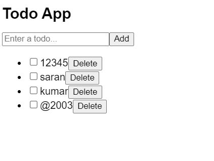

# Ex-05-Develop-a-complete-Todo-application-with-all-features
## Aim:-
To Develop a complete Todo application with all features
## Algorithm:-
### Step 1: 
Set up a React project
### Step 2: 
Create the TodoItem component
### Step 3: 
Create the TodoList component
### Step 4: 
Create the TodoApp component
### Step 5: 
Update and Use the TodoApp component
## Program:-
```js
import React, { useState } from 'react';

const TodoApp = () => {
  const [todos, setTodos] = useState([]);
  const [inputValue, setInputValue] = useState('');

  const handleInputChange = (event) => {
    setInputValue(event.target.value);
  };

  const handleFormSubmit = (event) => {
    event.preventDefault();
    if (inputValue.trim() !== '') {
      const newTodo = {
        id: Date.now(),
        text: inputValue,
        completed: false
      };
      setTodos([...todos, newTodo]);
      setInputValue('');
    }
  };

  const handleTodoToggle = (id) => {
    const updatedTodos = todos.map((todo) => {
      if (todo.id === id) {
        return { ...todo, completed: !todo.completed };
      }
      return todo;
    });
    setTodos(updatedTodos);
  };

  const handleTodoDelete = (id) => {
    const updatedTodos = todos.filter((todo) => todo.id !== id);
    setTodos(updatedTodos);
  };

  return (
    <div className="todo-app">
      <h1>Todo App</h1>
      <form onSubmit={handleFormSubmit}>
        <input
          type="text"
          placeholder="Enter a todo..."
          value={inputValue}
          onChange={handleInputChange}
        />
        <button type="submit">Add</button>
      </form>
      <ul>
        {todos.map((todo) => (
          <li key={todo.id}>
            <input
              type="checkbox"
              checked={todo.completed}
              onChange={() => handleTodoToggle(todo.id)}
            />
            <span className={todo.completed ? 'completed' : ''}>{todo.text}</span>
            <button onClick={() => handleTodoDelete(todo.id)}>Delete</button>
          </li>
        ))}
      </ul>
    </div>
  );
};

export default TodoApp;

```
## Output:-

## Result:-
 Created a complete Todo application with all the features using React.